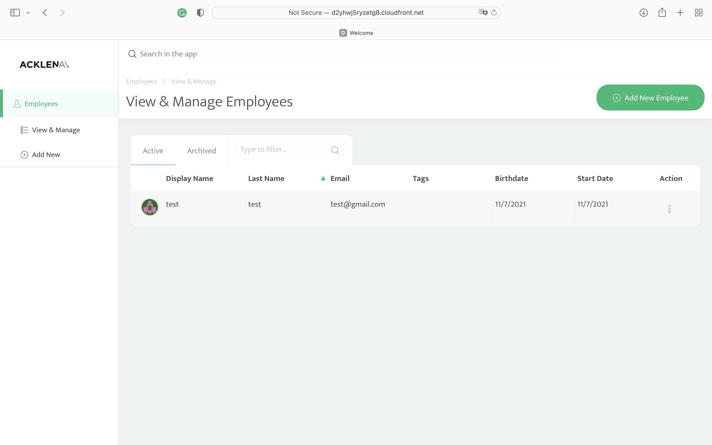

# Deploy an Application to AWS with CircleCI and Ansible

## Project Overview
I deployed an app to AWS with CircleCI and Ansible. Below are the main goals of the project:

- Explain the fundamentals and benefits of CI/CD to achieve, build, and deploy automation for cloud-based software products.
- Utilize Deployment Strategies to design and build CI/CD pipelines that support Continuous Delivery processes.
- Utilize a configuration management tool to accomplish deployment to cloud-based servers.
- Surface critical server errors for diagnosis using centralized structured logging.

## Dependencies
- [Circle CI](www.circleci.com) - Cloud-based CI/CD service
- [Amazon AWS](https://aws.amazon.com/) - Cloud services
- [AWS CLI](https://aws.amazon.com/cli/) - Command-line tool for AWS
- [CloudFormation](https://aws.amazon.com/cloudformation/) - Infrastrcuture as code
- [Ansible](https://www.ansible.com/) - Configuration management tool
- [Prometheus](https://prometheus.io/) - Monitoring tool

# Project Steps
1. Setup - AWS
- Create and download a new key pair in AWS EC2. Name this key pair "ec2" so that it works with the Cloud Formation templates.

- Add a PostgreSQL database in RDS that has public accessibility. [This tutorial](https://aws.amazon.com/getting-started/hands-on/create-connect-postgresql-db/) may help. As long as you marked "Public Accessibility" as "yes", you won't need to worry about VPC settings or security groups. Take note of the connection details, such as:
    ```
    Endpoint (Hostname): database-1.ch4a9dhlinpw.us-east-1.rds.amazonaws.com
    Instance identifier: database-1 //This is not the database name
    Database name: postgres (default)
    Username: postgres
    Password: mypassword
    Port: 5432
    ```
    Note that the AWS wizaard will create a default database with name postgres. If you wish to give another name to the initial database, you can do so in the additional configuration as shown in the snapshot below.

    Verify the connection to the new database from your local SQL client, using [this tutorial](https://aws.amazon.com/getting-started/hands-on/create-connect-postgresql-db/).


2. Set up - CircleCI

- Set up project in CircleCI.
    
- Add the SSH key (`*.pem`) to CircleCI.
    
- Add the environment variables to CircleCI by navigating to {project name} > Settings > Environment Variables.
    ```
    RUN_ID=asdfghj #random string
    AWS_ACCESS_KEY_ID=(from IAM user with programmatic access)
    AWS_SECRET_ACCESS_KEY= (from IAM user with programmatic access)
    AWS_SESSION_TOKEN= (from IAM user with programmatic access)
    AWS_DEFAULT_REGION=(your default region in aws)
    TYPEORM_CONNECTION=postgres
    TYPEORM_MIGRATIONS_DIR=./src/migrations
    TYPEORM_ENTITIES=./src/modules/domain/**/*.entity.ts
    TYPEORM_MIGRATIONS=./src/migrations/*.ts
    TYPEORM_HOST={your postgres database hostname in RDS}
    TYPEORM_PORT=5432 (or the port from RDS if it’s different)
    TYPEORM_USERNAME={your postgres database username in RDS}
    TYPEORM_PASSWORD={your postgres database password in RDS}
    TYPEORM_DATABASE=postgres {or your postgres database name in RDS}
    ENVIRONMENT=production
    ```
    

3. When a change has been pushed to GitHub non-main branch, it will test and scan the backend and frontend of the app.

4. When a change has been pushed to GitHub main branch, it will trigger the pipeline and deploy the backend and frontend of the app to aws.

5. The app allows you to add new employees. The frontend URL can be obtained through CloudFront. The backend URL can be seen through EC2.



